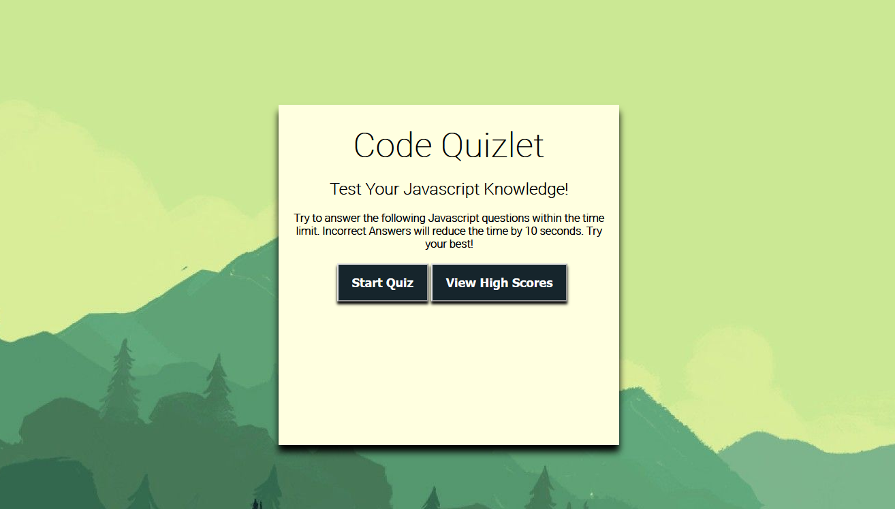
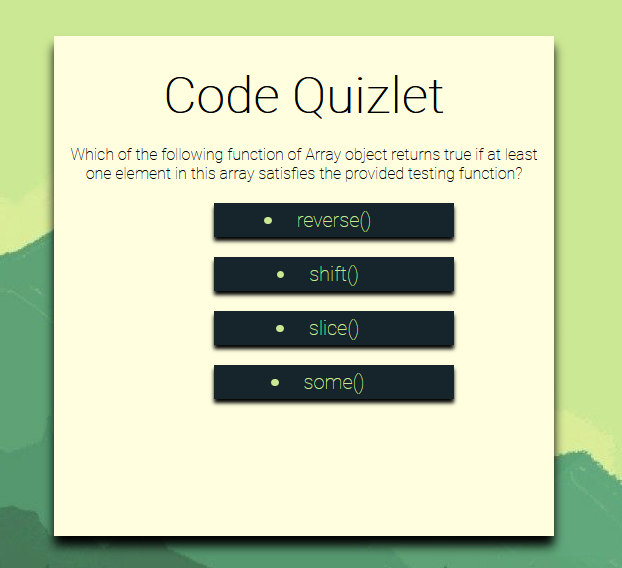
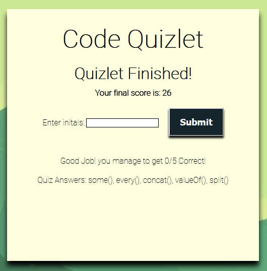

<h1 align="center">Code Quizlet</h1>

<!-- TABLE OF CONTENTS -->

  
Table of Contents

  <ol>
    <li>
      <a href="#about-the-project">About The Project</a>
      <ul>
        <li><a href="#built-with">Built With</a></li>
      </ul>
    </li>
    <li>
      <a href="#links">Links</a>
    <li><a href="#screenshot">Screenshots</a></li>
  </ol>

## About The Project

This repository contains the code for a Javascript Coding Quiz. This website helps familiarize users with a quiz which allows them to use the skills covered in the activities of Web APIs.

This assignment requires to build a timed coding quiz with multiple-choice questions. This app will run in the browser and will feature dynamically updated HTML and CSS powered by JavaScript code that was written. It has a clean, polished, and responsive user interface.

## Built With

- [HTML](https://html.spec.whatwg.org/)
- [CSS](https://www.w3.org/Style/CSS/Overview.en.html)
- [Javascript](https://www.javascript.com/)
- [Jquery](https://jquery.com/)

## Links

- [Website](https://kimshihyun.github.io/code-quizlet/)
- [Github Repo](https://github.com/KimShiHyun/code-quizlet/)

## Screenshot

The following image shows the web application's appearance and functionality:

